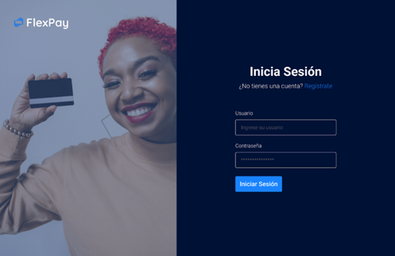
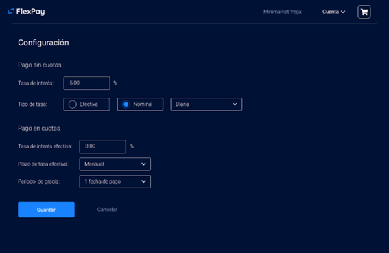
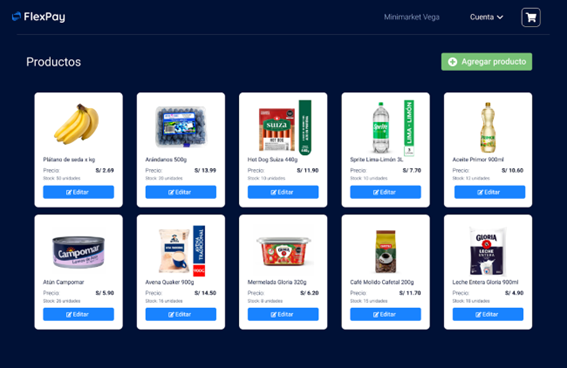
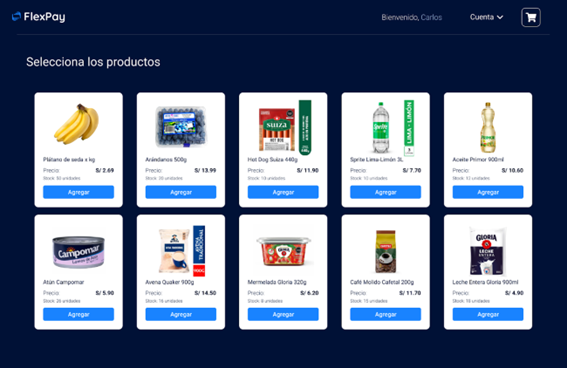
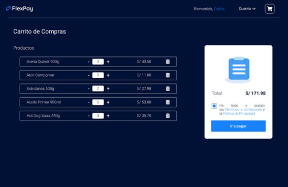
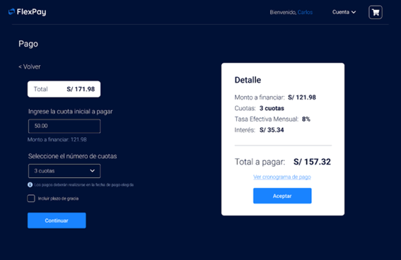

# Flexpay

Flexpay is a web application that enables small businesses to offer credit to their customers, simplifying the management of installment purchases. Users can log in as either a store or a customer, accessing features specific to their roles.

## Purpose

The purpose of **Flexpay** is to provide an accessible solution for small businesses and their customers, allowing:

- **Stores** to manage their products, set personalized interest rates, and handle credits effortlessly.
- **Customers** to explore registered stores, make credit purchases, and manage their payments efficiently.

## Features

### For Stores:

- **Interest Rate Configuration:** Set personalized interest rates.

- **Stock Management:** Add, edit, and remove products.

### For Customers:

- **Browse Registered Stores:** Access a variety of products.

- **Credit Purchases:** Facilitate purchases with installment payments.

## Available Scripts

In the project directory, you can run:

### `npm start`
Runs the app in development mode.  
Open [http://localhost:3000](http://localhost:3000) to view it in the browser.

### `npm test`
Launches the test runner in interactive watch mode.  
See the section about [running tests](https://facebook.github.io/create-react-app/docs/running-tests) for more information.

### `npm run build`
Builds the app for production to the `build` folder.  
It correctly bundles React in production mode and optimizes the build for the best performance.

### `npm run eject`
**Note: this is a one-way operation. Once you `eject`, you can’t go back!** 

## Learn More

You can learn more in the [Create React App documentation](https://facebook.github.io/create-react-app/docs/getting-started).

To learn React, check out the [React documentation](https://reactjs.org/).
